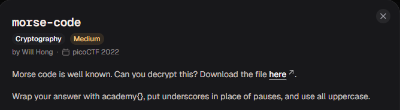
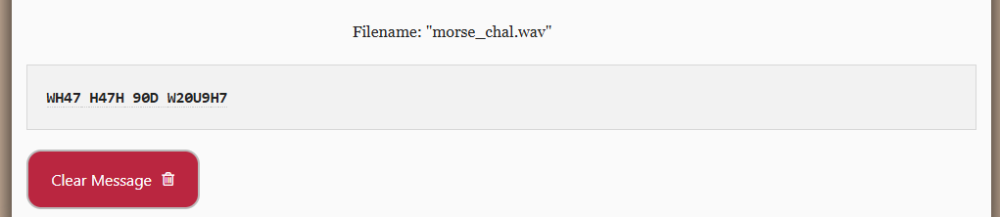

# morse-code

#### Category:Crypto - Diff: Medium

#### 1. Overview

* 
* `Mục tiêu`: GIải mã morse code

#### 2. Nền tảng cốt lõi

* Biết mã morse làm gì?

#### 3. Phân tích

* Đề cho ta một bản morse âm thanh

#### 4. Ý tưởng khai thác/ Exploit chain

* Vì đây là 1 file âm thanh, nên mình sẽ tìm công cụ để phiên dịch mã morse

* Công cụ mà mình tìm được: [Morse Decoder](https://morsecode.world/international/decoder/audio-decoder-adaptive.html)

* Sau khi đưa file âm thanh morse lên và giải mã, mình được bản plaintext như sau:

  * 

* #### Flag: academy{WH47_H47H_90D_W20U9H7}

#### 5. Reference

* Morse Decode: [Đọc](https://morsecode.world/international/decoder/audio-decoder-adaptive.html)

