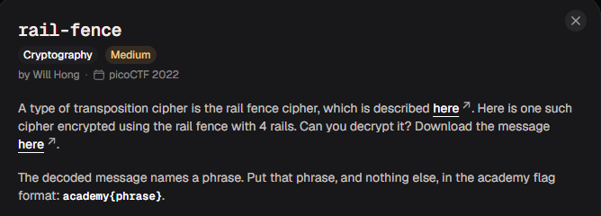
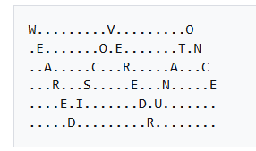

# rail-fence

#### Category: Crypto - Diff: Medium

#### 1. Overview

* 
* Đây là bài đầu tiên mình giải mã mã hóa cầu thang (`Rail fence cipher`)
* `Mục tiêu`: Giải mã ciphertext đã bị mã hóa `rail fence`

#### 2. Nền tảng cốt lõi

* Rail fence cipher: [Đọc](https://en.wikipedia.org/wiki/Rail_fence_cipher)

#### 3. Phân tích lỗ hỗng

* Đề cho ta biết ciphertext đã bị mã hóa `rail fence` và có số bậc thang là `4`

#### 4. Ý tưởng khai thác

* Mình có thể sử dụng tool có sẵn trên mạng để giải bài này, nhưng nếu code python để giải mã, ý tưởng của mình như sau:
  * Lấy ví dụ trong chính trang wikipedia:
  * 
  * `N = 6 là số lượng bậc thang` và `L = 24 là độ dài của plaintext`
  * Ý tưởng để giải mã là đưa các đường chéo về lại 1 đường thẳng. Ở bậc thang đầu tiên gồm các kí tự `WVO`. Khi đưa vào đường thẳng, mỗi kí tự sẽ cách nhau khoảng cách `2 * N - 2 = 2 * 6 - 2 = 10`
  * Trực quan hơn là 2 kí tự `W` và `V` sẽ cách `9 ô (chưa tính vị trí chính kí tự V)`, ở giữa 2 kí tự trên đường thẳng như trong ảnh sẽ là `EAREDISCO`
  * 3 ví trí cần điền của bậc thang đầu tiên là `[0, 10, 20]`
  * Sau khi duyệt qua hết bậc thang đầu tiên, các vị trí cần điền ở bậc thang thứ 2 sẽ tính bằng cách phân nhánh từ bậc thang thứ 1 bằng cách lấy các vị trí ở bậc thang trước đó, `+1` và `-1`  cho các vị trí đó theo 1 số quy tắc
  * `Ví dụ`: Các vị trí trên đường thẳng ở bậc thang đầu tiên: `[0, 10, 20]` -> Các vị trí của các kí tự ở bậc thang thứ 2 là: `[1, 9, 11, 19, 21]`
  * Ý tưởng để tạo ra các vị trí cho các kí tự ở bậc thang tiếp theo cần phải thỏa 3 điều kiện:
    * Các vị trí mới của bậc thang phải nằm trong khoảng từ `[0, L - 1]`
    * Giá trị ở các vị trí đó trên đường thẳng phải chưa được lưu kí tự nào `(Khác None, đọc code để hiểu hơn)`
    * Mỗi vị trí là độc nhất `(Mỗi giá trị vị trí chỉ được phép có 1 bản sao duy nhất. Ví dụ: [1, 3, 5] -> [0 , 2 , 2, 4, 4, 6] Sai!:[0, 2, 4, 6] Đúng!)`
  * Và chạy cho đến khi hết bậc thang là ta thu được plaintext gốc!

#### 5. Exploit chain

* Quy trình: 

  * Viết hàm giải mã `rail fence` 
  * Giải mã ciphertext

* Script: [Đọc](solve.py)

* Kết quả: `The flag is: WH3R3_D035_7H3_F3NC3_8361N_4ND_3ND_8CEF1166`

* #### Flag: academy{WH3R3_D035_7H3_F3NC3_8361N_4ND_3ND_8CEF1166}

#### 6. Reference

* Rail fence cipher: [Đọc](https://en.wikipedia.org/wiki/Rail_fence_cipher)

