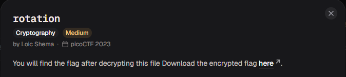

# rotation

#### Category: Crypto - Diff: Medium

#### 1. Overview

* 
* `Mục tiêu`: Giải mã ciphertext
* `Kỹ thuật`: Shifted

#### 2. Nền tảng cốt lõi

* Biết sử dụng 1 số loại mã hóa trên cyberchef

#### 3. Ý tưởng khai thác/Exploit chain

* ```wiki
  ikilmug{z0bib1wv_l3kzgxb3l_76m5m998}
  ```

* Bạn chỉ cần lên [cyberchef](https://gchq.github.io/CyberChef/) rồi sử dụng mã hóa ROT13, rồi chỉnh thông số cho đến khi ra cờ thôi

* Hoặc là bạn có thể sử dụng script của mình!

* Script: [Đọc](solve.py)

* #### Flag: academy{r0tat1on_d3crypt3d_76e5e998}