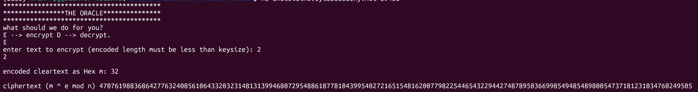
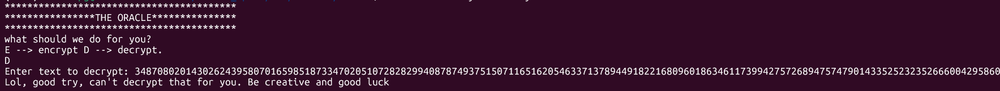

# rsa_oracle

#### Category: Crypto - Diff: Medium

#### 1. Overview

* Đây là bài đầu tiên mình sử dụng oracle để giải Crypto =))))
* `Mục tiêu`: Sử dụng oracle bị lộ để giải mã cờ
* `Kỹ thuật`: Sử dụng oracle

#### 2. Nền tảng cốt lõi

* Các bạn cần hiểu cách thuật toán RSA hoạt động
* Biết sử dụng cú pháp openssl để giải mã cờ

#### 3. Phân tích lỗ hổng

* Khi kêt nối nc đến đường dẫn server, mình thử chế độ encrypt để xem thử thuật toán mã hóa của nó là gì
  * 
* Nó là thuật toán RSA.
* Theo như đề bài thì password của ciphertext cũng đã bị mã hóa RSA, mình thử cipher password ở mục Decrypt luôn thì
  * 
* Vậy thì ngoại trừ chính mật khẩu, các phần còn lại đều có thể gửi bất kì thứ gì để nó decrypt, vậy ta sẽ biến đổi password thành 1 cái gì đó khác rồi để cho oracle nhả ra cho mình, rồi đảo ngược lại quá trình mình tác động lên password gốc để thu lại password.
* Chi tiết hơn mình sẽ lấy 1 hệ số gradient là `2`
  * Khi gửi payload là `2` lên ở mục Encrypt, server sẽ nhả về cho ta `2^e mod N`, khi ta lấy hệ số đó nhân với cipher password rồi gửi lên ở mục decrypt thì nó sẽ được giải mã như sau:
  * 
  * Ta chỉ cần lấy dãy hex đề nhả ra chia cho 2 rồi đưa nó về dạng bytes là ta lấy được password.
* Sau đó là quá trình giải mã AES để lấy được cờ

#### 4. Exploit chain

* Quy trình:

  * Gửi bytes `\x02` ở mục Encrypt để thu được `2^e`

  * Nhân `2^e` với cipher password

  * Gửi payload kết quả của phép tính trên, server sẽ trả về cho ta kết quả là password*2

  * Ta chia 2 với kết quả nhận được và in nó dưới dạng kí tự để lấy được mật khẩu

  * Sử dụng bash openssl để giải mã AES:

  * ```bash
    openssl enc -aes-256-cbc -in secret.enc -out flag.txt -k <password nhận được>
    ```

* Script: [Đọc](solve.py)

* #### Flag: [Đọc](flag.txt)