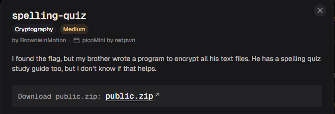
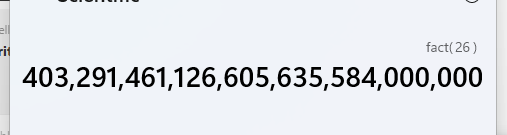
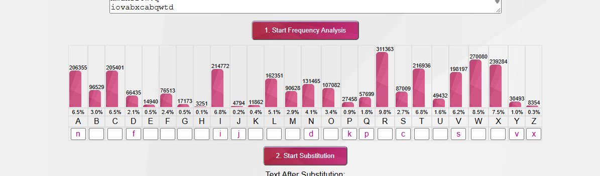
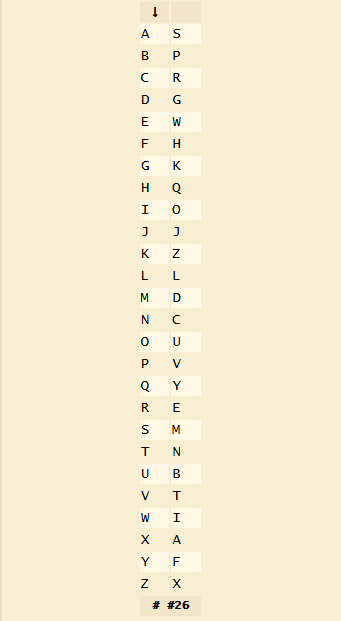

# spelling-quiz

#### Category: Crypto - Diff: Medium

#### 1. Overview

* 
* Một bài troll định dạng cờ, làm mình tưởng mình giải sai =))))
* `Mục tiêu`: Giải mã flag.txt
* `Kỹ thuật`: Frequency attack

#### 2. Nền tảng cốt lõi

* Nên làm các bài tập subtraction trước khi làm bài này
* Biết được cách tấn công tần suất - Frequency attack

#### 3. Phân tích

* Đề cho ta 1 file nén, khi giải nén ra ta nhận được 1 đoạn `encrypt.py`, `flag.txt` và `study-guide.txt`
* Tóm tắt chức năng của file `encrypt.txt` là mã hóa toàn bộ các file có đuôi `txt` trong thư mục hiện tại (thư mục hiện tại bao gồm `flag.txt` và `study-guide.txt`)
* File python mã hóa bằng cách ánh xạ `bảng chứ cái gốc (abcdef...)` sang `bảng chữ cái mới tạo ra bằng hàm shuffle`

#### 4. Ý tưởng khai thác

*  Lúc đầu đã nghĩ đến Brute Force, nhưng khi tính toán thử số trường hợp hoán vị bảng chữ cái có thể xảy ra, mình đã phải bỏ ngay cách này:
* 
* Sau đó mình lại đọc kĩ lại đề rằng là: `file study-guide chính là file spelling quiz`
* Đó là 1 file chứa toàn bộ những chữ tiếng anh trong các bài kiểm tra nói nên khi biết file đó chứa các từ tiếng anh, mình đã đổi hướng từ brute force sang tấn công tần suất - `Frequency attack`

#### 5. Exploit chain

* Mình thử tự phân tích thì như sau:

* 

* Mình thấy bản thân đang không thực sự giải đúng hướng, và công cụ cũng không quá hỗ trợ, nên mình đã tìm kiếm những công cụ tốt hơn.

* Mình tìm được công cụ ở trang web [dcode](https://www.dcode.fr/frequency-analysis), sau đó mình copy toàn bộ file study-guide vào web để trang web tính toán và đưa ra 1 bộ chuyển đối đề xuất

* 

* Sau đó mình dựa vào bản đề xuất này để giải mã flag.txt

* Script: [Đọc](solve.py)

* Kết quả: `perhaps_the_dog_qumped_over_was_qust_tired`

* Mình thấy nó sai sai nên đổi thành: `perhaps_the_dog_jumped_over_was_just_tired`

* Và định dạng cờ của bài này là `picoCTF` chứ không phải `academy` =))))), làm mình tưởng mình đã giải sai đoạn nào đó.

* #### Flag: picoCTF{perhaps_the_dog_qumped_over_was_qust_tired}

#### 5. Reference

* 101computing frequency analysis: [Đọc](https://www.101computing.net/frequency-analysis/)
* dcode frequency analysis: [Đọc](https://www.dcode.fr/frequency-analysis)