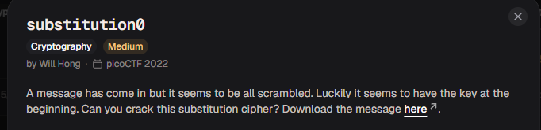

# substitution0

#### Category: Crypto - Diff: Medium

#### 1. Overview

* 
* `Mục tiêu`: Giải mã đoạn message dựa vào chìa khóa ở đầu message

#### 2. Nền tảng cốt lõi

* Hiểu cách mã hóa thay thế kí tự

#### 3. Phân tích lỗ hỗng

* Đây là đoạn message:

* ```wi
  HRZUEVABDLIOJYTGNXCMWPKSQF 
  
  Bexewgty Oeaxhyu hxtce, kdmb h axhpe hyu cmhmeoq hdx, hyu rxtwabm je mbe reemoe
  vxtj h aohcc zhce dy kbdzb dm khc eyzotceu. Dm khc h rehwmdvwo czhxhrhewc, hyu, hm
  mbhm mdje, wyiytky mt yhmwxhodcmc—tv ztwxce h axehm gxdfe dy h czdeymdvdz gtdym
  tv pdek. Mbexe kexe mkt xtwyu rohzi cgtmc yehx tye esmxejdmq tv mbe rhzi, hyu h
  otya tye yehx mbe tmbex. Mbe czhoec kexe eszeeudyaoq bhxu hyu aotccq, kdmb hoo mbe
  hggehxhyze tv rwxydcbeu atou. Mbe kedabm tv mbe dycezm khc pexq xejhxihroe, hyu,
  mhidya hoo mbdyac dymt ztycduexhmdty, D ztwou bhxuoq rohje Lwgdmex vtx bdc tgdydty
  xecgezmdya dm.
  
  Mbe voha dc: hzhuejq{5WR5717W710Y_3P0OW710Y_4VRU1ER7}
  ```

* Và key được nhắc tới là:

* ```wi
  HRZUEVABDLIOJYTGNXCMWPKSQF
  ```

* Key này dài 26 kí tự, nên nó có thể là bản chữ cái đã bị mã hóa.

#### 4. Ý tưởng khai thác

* Ta đã có thể dự đoán rằng key chính là bản chữ cái đã bị mã hóa, nên chúng ta sẽ biến đoạn message này từ bản chữ cái `HRZUEVABDLIOJYTGNXCMWPKSQF` ánh xạ qua bản chữ cái gốc là `ABCDEFGHIJKLMNOPQRSTUVWXYZ`

#### 5. Exploit chain

* Quy trình:

  * Viết 2 tập hợp gồm bản chữ cái đã bị mã hóa và bản chữ cái gốc.
  * Biến tất cả kí tự thuộc message ánh xạ qua bản chữ cái gốc

* Script: [Đọc](solve.py)

* #### Flag: academy{5UB5717U710N_3V0LU710N_4FBD1EB7}