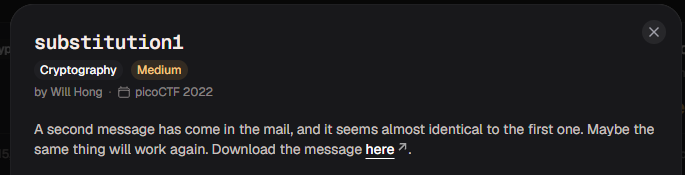
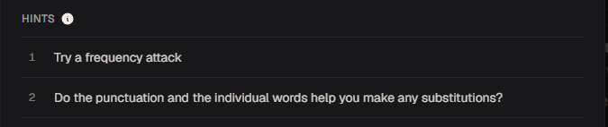
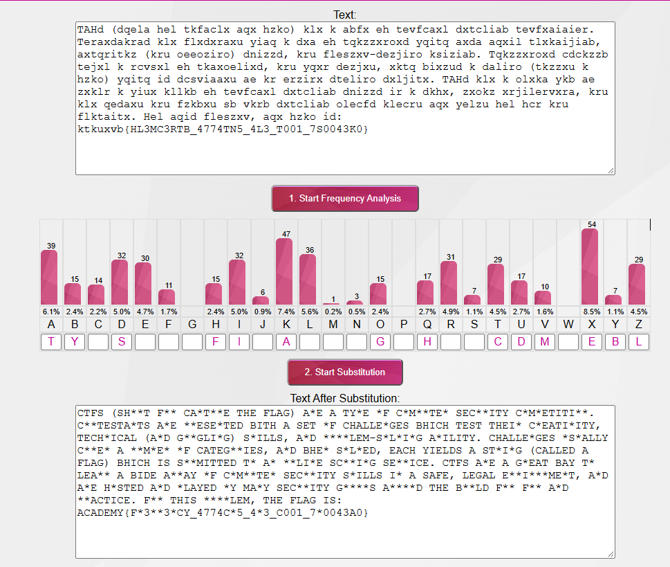
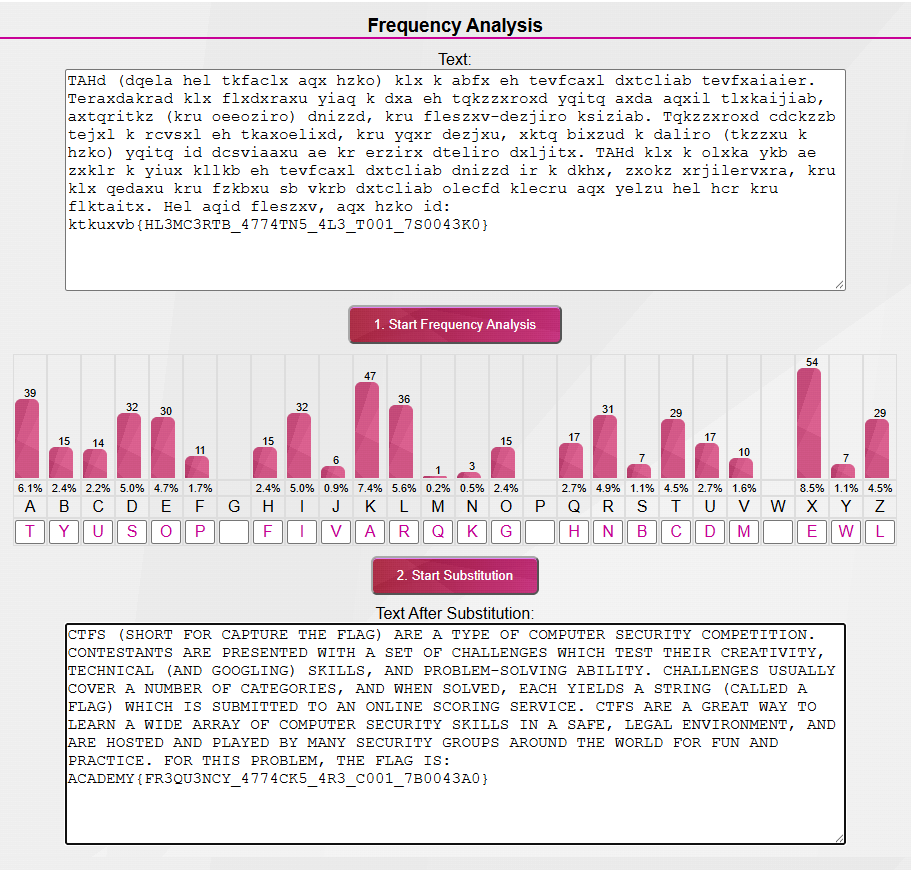

# substitution1

#### Category: Crypto - Diff: Medium

#### 1. Overview

* 
* Đây là bài đầu tiên mình sử dụng thủ thuật thám mã để giải mã cờ =)))))
* `Mục tiêu`: Giải mã message bằng thủ thuật thám mã để lấy cờ
* `Kỹ thuật`: Thám mã

#### 2. Nền tảng cốt lõi

* Có nền tiếng anh đủ tốt để đọc hiểu, đưa ra suy luận về xác suất kí tự
* Hiểu cách vận thủ thuật thám mã

#### 3. Phân tích lỗ hỗng

* Khác với `substitution0` thì lần này, chúng ta không còn có `key` để giải mã nữa.
* Hint: 
* Dựa vào hint, mình bắt đầu tra cứu cách `tấn công tần xuất - frequency attack` được sử dụng như thế nào. Thì một cách đơn giản dễ hiểu là sử dụng tư duy đọc hiểu để phán đoán các kí tự được thay thế như thế nào thôi. Một phương pháp cực kỳ dễ

#### 4. Ý tưởng khai thác/Exploit chain

* Dựa vào thông tin của hint và định dạng format cờ.Mình sẽ sử dụng trang web [Frequency Analysis](https://www.101computing.net/frequency-analysis/) để thám mã và dịch chuyển các kí tự cờ trong message thành định dạng format cờ chuẩn:

*  

* Sử dụng vốn tiếng anh của mình, mình dễ dàng thám mã ra tất cả các ký tự còn lại.

* 

* Đây là script python nếu các bạn muốn có đoạn code để giải mã: [Đọc](solve.py)

* #### Flag: academy{FR3QU3NCY_4774CK5_4R3_C001_7B0043A0}

