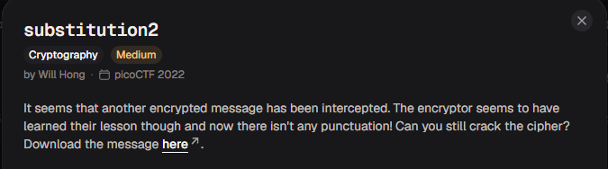
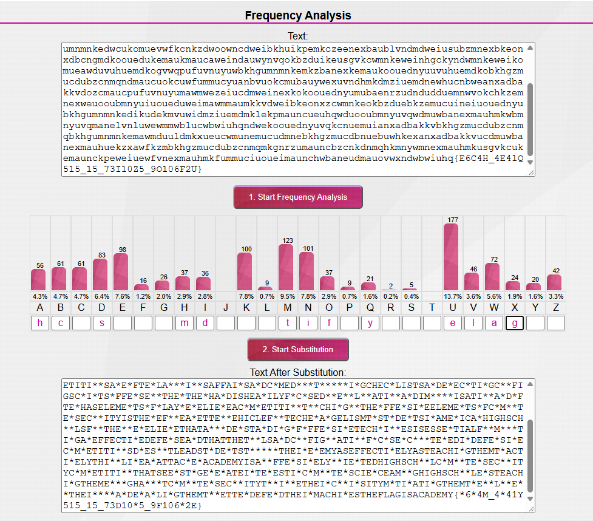
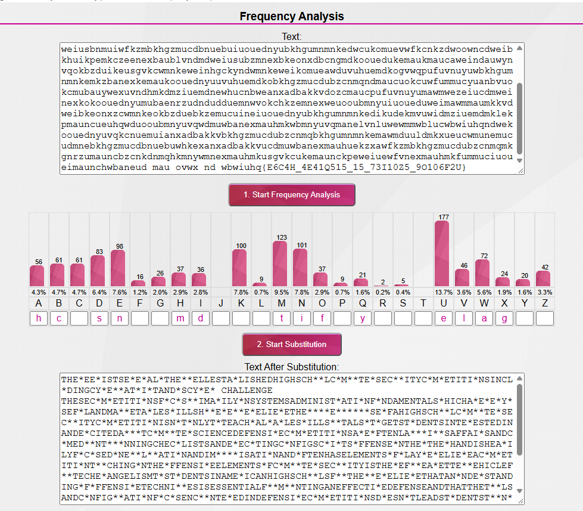
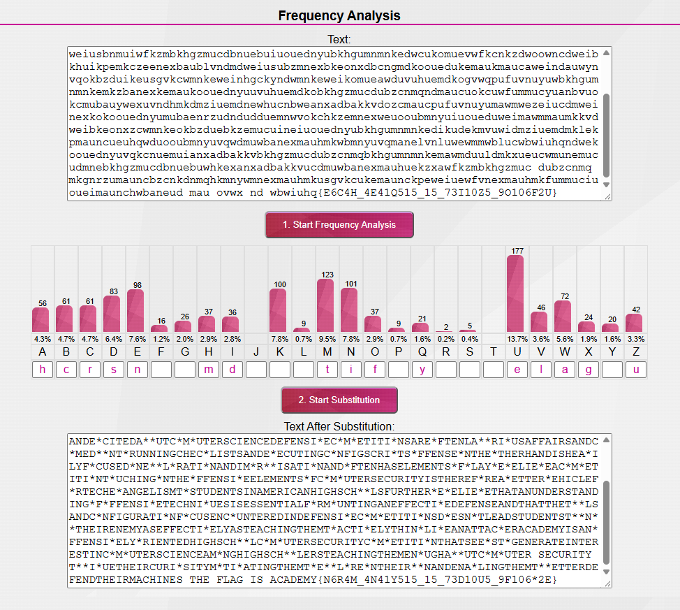
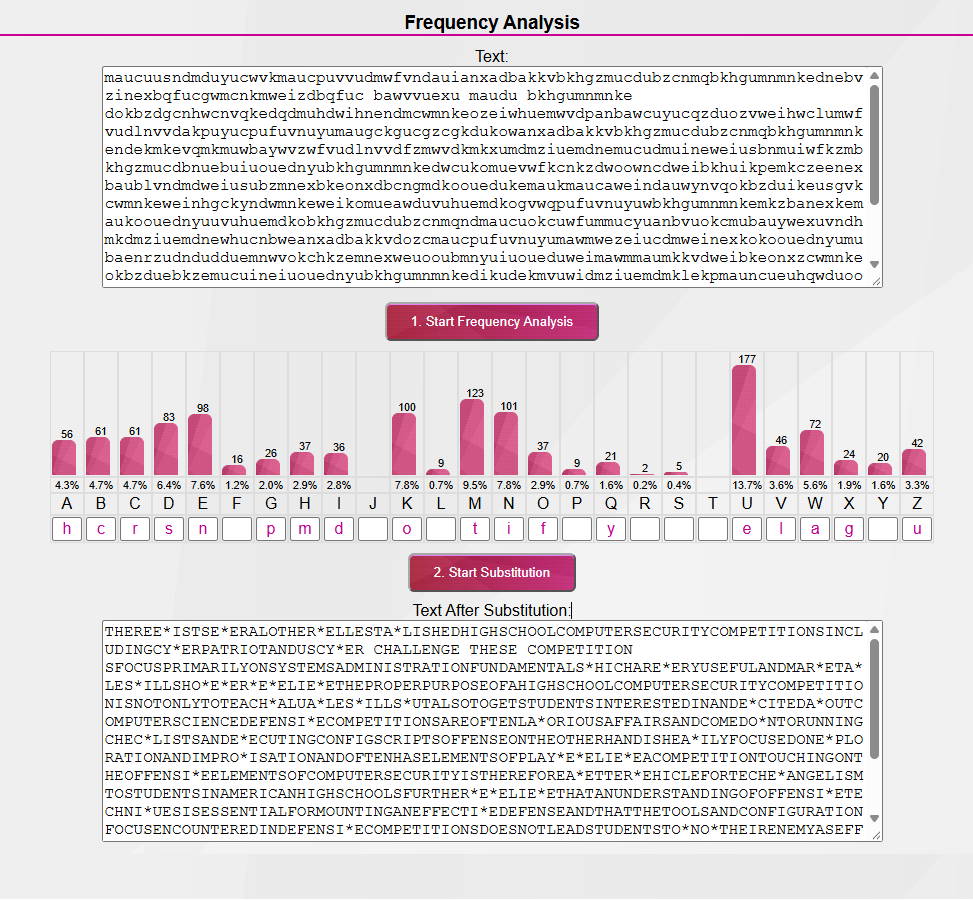
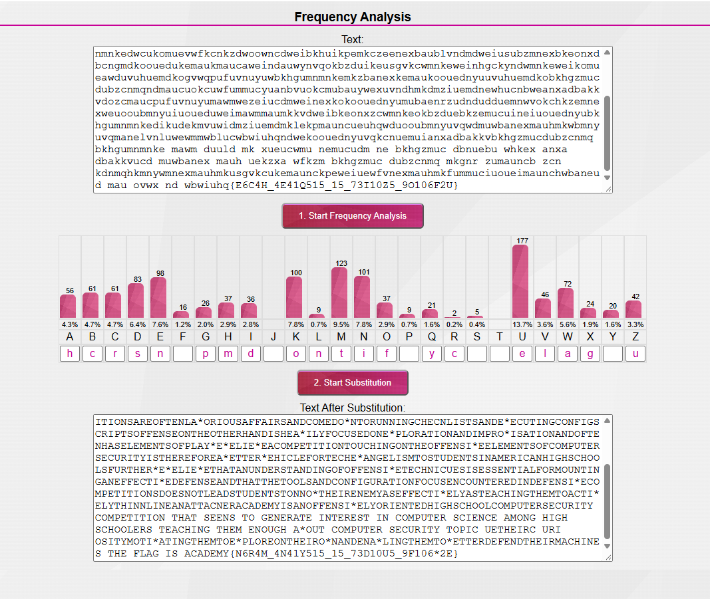
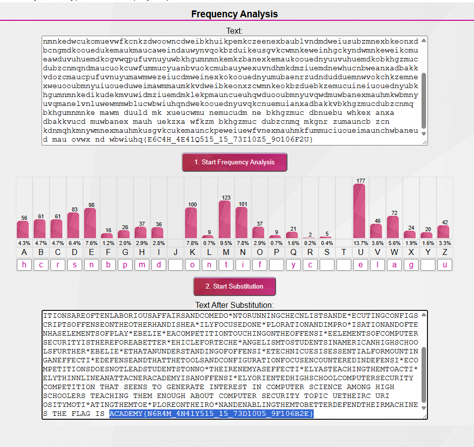

# substitution2

#### Category: Crypto - Diff: Medium

#### 1. Overview

* 

* Đây là bài cuối cùng của chuỗi bài substitution và cũng là bài khó nhất trong cả 3 ~~nhưng vẫn dễ~~
* `Mục tiêu`: Giải mã message bằng thám mã
* `Kỹ thuật`: Thám mã

#### 2. Nền tảng cốt lõi

* Biết và hiểu cách thủ thuật thám mã
* Đọc hiểu tiếng anh tốt
* Nên làm trước bài `substitution1` và `substitution0` trước khi làm bài này

#### 3. Phân tích lỗ hỗng

* Trong bài này, message đã bỏ đi tất cả các dấu câu, các dấu cách, nên việc khôi phục sẽ lâu hơn.

#### 4. Ý tưởng khai thác/Exploit chain

* Dựa vào 2 bài trước, ta có thể dự đoán được câu tiếng anh trước khi ghi cờ là `The flag is academy{...}` , nên bước đầu tiên là khôi phục lại câu tiếng anh này.

* 

* Sau đó mình thấy có chữ `challenge` gần được hồi phục nên mình hồi phục được thêm chữ `n`

* 

* Tiếp theo là chữ `security`

* 

* Tiếp theo là `these competitions`

* 

* Sau đó khôi phục được 1 đoạn dài có ý nghĩa:

* 

* Cuối cùng là khôi phục chữ `about` và ta thu được cờ!

* 

* Script bằng python nếu bạn nào muốn: [Đọc](solve.py)

* #### Flag: academy{N6R4M_4N41Y515_15_73D10U5_9F106B2E}

#### 5. Reference

* Frequency analysis: [Đọc](https://www.101computing.net/frequency-analysis/)

