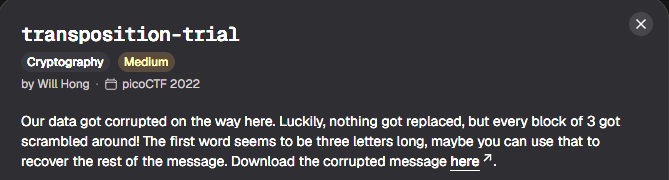
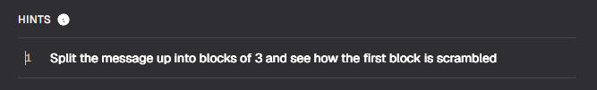

# transposition-trial

#### Category: Crypto - Diff: Medium

#### 1. Overview

* 
* `Mục tiêu`: Giải mã quá trình trộn của message để lấy được cờ

#### 2. Nền tảng cốt lõi

* Thật sự mình chả biết phải viết cái gì chỗ này =))))))))

#### 3. Phân tích lỗ hỗng

* Hint: 

* Đây là đoạn message:

* ```wiki
  heTfl g as icaaemd{7y4NRP051N5_16_35P3X51N3_V7F2D46C}5
  ```

* Khi lấy 3 khối đầu ta sẽ được `heT`, khi đưa chữ `T` lên đầu khối, ta sẽ thu được chữ `The`

* Đối với 2 khối tiếp theo cũng tương tự:

* ```wi
  "fl " -> " fl" : "g a" -> "ag " : Nối cả 3 khối lại ta được "The flag "
  ```

* Vậy ta chỉ cần đưa kí tự cuối cùng của khối lên đầu khối là giải mã thành công.

#### 4. Exploit chain

* Quy trình:

  * Cho chạy biến đếm , tăng lên 3 lần sau mỗi bước
  * Cộng các kí tự theo thứ tự `i+2`, `i` ,`i+1`

* Script: [Đọc](solve.py)

* #### Flag: academy{7R4N5P051N6_15_3XP3N51V3_27F6D45C}