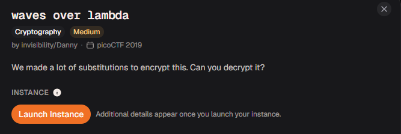
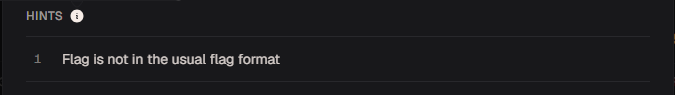
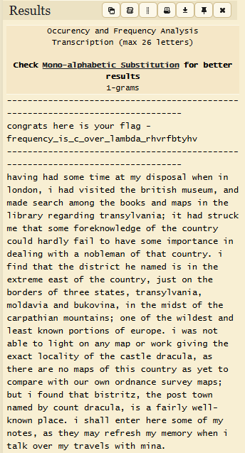

# waves over lambda

#### Category: Crypto - DiffL Medium

#### 1. Overview



* `Mục tiêu`: Giải mã đoạn message
* `Kỹ thuật`: Tấn công tần suất - Frequency attack

#### 2. Nền tảng cốt lõi

* Biết cách tấn công tần suất
* Nên làm các bài `substitution0,substitution1,substitution2,,spelling-quiz` của picoCTF trước khi làm

#### 3. Phân tích lỗ hỗng

* Khi netcat đến server, chúng ta được cung cấp 1 đoạn chat

* ```wiki
  -------------------------------------------------------------------------------
  hnqmzybv kozo lv anez ufym - uzoweoqha_lv_h_nsoz_fyxcdy_zkszucbaks
  -------------------------------------------------------------------------------
  kyslqm kyd vnxo blxo yb xa dlvinvyf rkoq lq fnqdnq, l kyd slvlbod bko czlblvk xevoex, yqd xydo voyzhk yxnqm bko cnnjv yqd xyiv lq bko flczyza zomyzdlqm bzyqvafsyqly; lb kyd vbzehj xo bkyb vnxo unzojqnrfodmo nu bko hneqbza hnefd kyzdfa uylf bn kyso vnxo lxinzbyqho lq doyflqm rlbk y qncfoxyq nu bkyb hneqbza. l ulqd bkyb bko dlvbzlhb ko qyxod lv lq bko otbzoxo oyvb nu bko hneqbza, pevb nq bko cnzdozv nu bkzoo vbybov, bzyqvafsyqly, xnfdysly yqd cejnslqy, lq bko xldvb nu bko hyziybklyq xneqbylqv; nqo nu bko rlfdovb yqd foyvb jqnrq inzblnqv nu oeznio. l ryv qnb ycfo bn flmkb nq yqa xyi nz rnzj mlslqm bko otyhb fnhyflba nu bko hyvbfo dzyhefy, yv bkozo yzo qn xyiv nu bklv hneqbza yv aob bn hnxiyzo rlbk nez nrq nzdqyqho vezsoa xyiv; ceb l uneqd bkyb clvbzlbg, bko invb bnrq qyxod ca hneqb dzyhefy, lv y uylzfa roff-jqnrq ifyho. l vkyff oqboz kozo vnxo nu xa qnbov, yv bkoa xya zouzovk xa xoxnza rkoq l byfj nsoz xa bzysofv rlbk xlqy.
  ```

* Hint: 

#### 4. Ý tưởng khai thác

* Khi gặp các bài bị xáo trộn như này và không cung cấp thông tin gì thêm, mình nghĩ ngay đến tấn công tần xuất!
* Ý tưởng là mình sẽ đưa lên tool phân tích tần suất, từ ngữ tiếng anh, để tìm được đoạn message phù hợp nhất

#### 5. Exploit chain

* Copy đoạn message lên trang [dcode frequency-analysis](https://www.dcode.fr/frequency-analysis) để phân tích

* 

* Theo như hint thì cờ không có định dạng, nên cờ của bài này chính là:

* #### Flag: frequency_is_c_over_lambda_rhvrfbtyhv